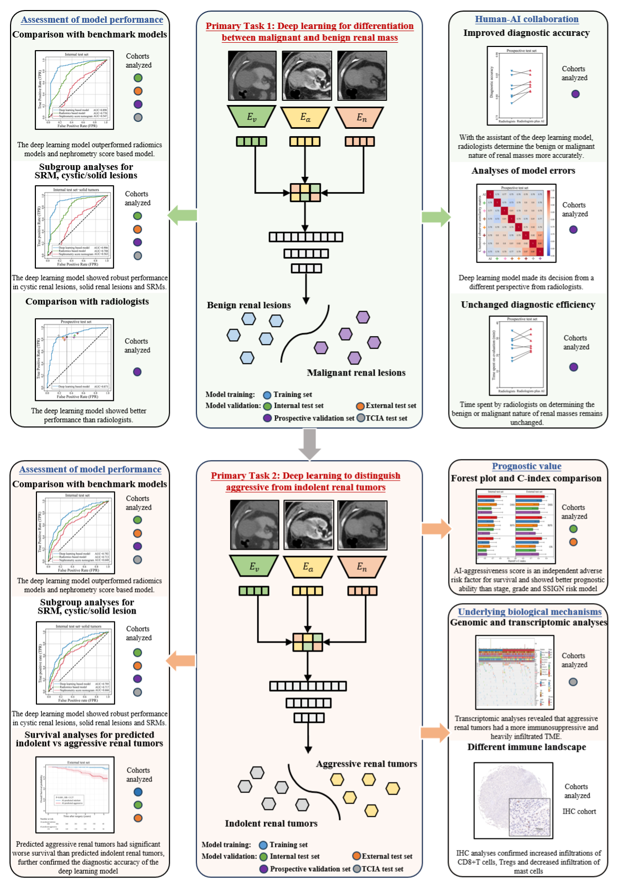

# Renal-Mass-AI
This repo contains the codes for the segmentation, pre-processing, radiomics and deep learning-based prediction of pathologic outcomes using pre-operative multi-phase CT, as reported in the paper **Artificial Intelligence Links Preoperative CT Images to Pathologic Features, Survival Outcomes and Biological Behaviors of Renal Masses Using Real-World Data**.

[[paper](https://www.nature.com/articles/s41467-025-56784-z)]



## Dependencies
To install Python dependencies (This project requires Python **3.8 or greater**):
```
pip install -r requirements.txt
```
Note that the current PyTorch installation does not support CUDA capabilities sm_37, sm_50, sm_60, sm_70. **If your device belongs to the RTX 30 series or later, you can use the following command:**:
 ```
 pip install torch==1.9.0+cu111 -f  https://download.pytorch.org/whl/cu111/torch_stable.html
 ```

## Tumor segmentation
We employed the nnUNet (Version 1) framework to perform the segmentation of kidney and tumors. Please refer to the [nnUNet repository](https://github.com/MIC-DKFZ/nnUNet/tree/nnunetv1) for the configuration settings. The task ID for kidney tumor segmentation is 135 and segmentation models trained on [KiTS](https://kits19.grand-challenge.org/data/) can be downloaded. To use nnUNet directly:

```
nnUNet_predict -i INPUT_FOLDER -o OUTPUT_FOLDER -t 135 -m 3d_lowres
```
where `INPUT_FOLDER` is the directory containing arterial phase CT images (*.nii.gz), and `OUTPUT_FOLDER` is the directory where the segmentation masks of the kidney, along with tumors and cysts, are saved. In our work, we fine-tuned the segmentation models with in-house dataset and obtained improved segmentation of kidney (label 1), tumor (label 2) and cyst (label 3).

## Image preprocessing
Based on the segmentation results, we located and cropped the kidney tumor. The axial slice with maximum tumor area was extracted (reviewed by experts) and resampled to a spatial resolution of $0.625\ mm \times\ 0.625\ mm$, followed by cropping with an ROI of $224\ pixels \times\ 224\ pixels$ centering around the tumor mass center. For the segmentation failure, the mass center was manually positioned.

Please see the [preprocess](./preprocess) folder for details.


## Radiomics analysis
The radiomics analysis was conducted using [PyRadiomics](https://github.com/AIM-Harvard/pyradiomics). Please see the [documentation](https://pyradiomics.readthedocs.io/en/latest/installation.html) for installation and configuration.
We extracted the shape features, histogram features, texture features of cropped multi-phase axial slices. Radiomics models for predicting malignancy and invasiveness were developed independently. LASSO regression was used for feature selection and Random Forest classifier was used for prediction.

Please see the [radiomics](./radiomics) folder for implementation details.

## Deep learning models
We developed a multi-view CNN with an intermediate feature fusion strategy. The image features were extracted utilizing the ResNet18 backbone and fused to make downstream task. The architecture was the same for the malignancy and invasiveness prediction tasks.
Please see the [DL](./DL) folder for implementation details.

train:
```
python ./DL/train_malignancy_classification_NAV.py --epoch 200 --tag test --lr 1e-5
python ./DL/train_invasiveness_classification_NAV.py --epoch 200 --tag test --lr 1e-5
```

test:
```
python ./DL/test_malignancy_classification_NAV.py
python ./DL/test_invasiveness_classification_NAV.py
```

## Citation
Xiong, Y., Yao, L., Lin, J. et al. Artificial intelligence links CT images to pathologic features and survival outcomes of renal masses. Nat Commun 16, 1425 (2025). https://doi.org/10.1038/s41467-025-56784-z

If you have any question, please direct any inquiries to (shuowang@fudan.edu.cn). Trained model weights are available for non-commercial collaborative research projects subject to a formal agreement.
